<div align="center">

# 🎓 Student Performance Predictor

### *AI-Powered Math Score Prediction System*

[](https://python.org)
[](https://flask.palletsprojects.com/)
[](https://scikit-learn.org/)
[](https://xgboost.readthedocs.io/)
[](https://catboost.ai/)

<p align="center">
  <strong>An end-to-end machine learning project that predicts student math scores based on demographics, parental education, and other exam performance.</strong>
</p>

[✨ Features](#-features) • [🚀 Quick Start](#-quick-start) • [📊 Model Performance](#-model-performance) • [🏗️ Architecture](#️-project-architecture) • [📁 Project Structure](#-project-structure)

</div>

---

## 🎯 Overview

The **Student Performance Predictor** is a comprehensive machine learning solution that analyzes various factors affecting student academic performance. Using advanced regression algorithms, it predicts mathematics scores based on:

- 👤 **Demographics**: Gender and race/ethnicity
- 👨‍👩‍👧 **Family Background**: Parental level of education
- 🍽️ **Socioeconomic Indicators**: Lunch type (standard/free-reduced)
- 📚 **Academic Preparation**: Test preparation course completion
- ✍️ **Performance Metrics**: Reading and writing scores

---

## ✨ Features

<table>
<tr>
<td width="50%">

### 🔬 ML Pipeline
- **Automated Data Ingestion** — Seamless data loading and train-test splitting
- **Smart Preprocessing** — Handles numerical scaling and categorical encoding
- **Multi-Model Training** — Evaluates 7 different algorithms
- **Hyperparameter Tuning** — GridSearchCV optimization

</td>
<td width="50%">

### 🌐 Web Application
- **Flask-Powered API** — RESTful prediction endpoint
- **Interactive UI** — User-friendly form interface
- **Real-time Predictions** — Instant score estimation
- **Production-Ready** — AWS Elastic Beanstalk compatible

</td>
</tr>
</table>


---

## 📊 Model Performance

The system evaluates **7 different regression algorithms** and automatically selects the best performer:

| Model | Description |
|-------|-------------|
| 🌲 **Random Forest** | Ensemble of decision trees |
| 🌳 **Decision Tree** | Single tree-based regressor |
| 📈 **Gradient Boosting** | Sequential ensemble method |
| 📉 **Linear Regression** | Baseline linear model |
| ⚡ **XGBoost** | Extreme gradient boosting |
| 🐱 **CatBoost** | Categorical feature optimized |
| 🔄 **AdaBoost** | Adaptive boosting regressor |

The best model is automatically saved based on R² score > 0.6 threshold.

---

## 🏗️ Project Architecture

```mermaid
flowchart LR
    A[📥 Data Ingestion] --> B[🔄 Data Transformation]
    B --> C[🎯 Model Training]
    C --> D[💾 Model Storage]
    D --> E[🌐 Flask App]
    E --> F[👤 User Prediction]
```



### Pipeline Components

1. **Data Ingestion** (`data_ingestion.py`)
   - Reads source data from CSV
   - Performs train-test split (80-20)
   - Saves processed datasets to artifacts

2. **Data Transformation** (`data_transformation.py`)
   - Numerical features: Median imputation + Standard scaling
   - Categorical features: Mode imputation + One-hot encoding
   - Saves preprocessor pipeline as pickle

3. **Model Training** (`model_trainer.py`)
   - Trains 7 different regression models
   - Uses GridSearchCV for hyperparameter optimization
   - Saves best performing model

4. **Prediction Pipeline** (`predict_pipeline.py`)
   - Loads trained model and preprocessor
   - Transforms new data and generates predictions

---

## 📁 Project Structure

```
mlproject/
│
├── 📂 src/                      # Source code
│   ├── 📂 components/           # ML pipeline components
│   │   ├── data_ingestion.py    # Data loading & splitting
│   │   ├── data_transformation.py # Feature preprocessing
│   │   └── model_trainer.py     # Model training & selection
│   │
│   ├── 📂 pipeline/             # Prediction pipeline
│   │   └── predict_pipeline.py  # Inference code
│   │
│   ├── exception.py             # Custom exception handling
│   ├── logger.py                # Logging configuration
│   └── utils.py                 # Utility functions
│
├── 📂 notebook/                 # Jupyter notebooks
│   ├── 1. EDA STUDENT PERFORMANCE.ipynb
│   └── 2. MODEL TRAINING.ipynb
│
├── 📂 artifacts/                # Generated artifacts
│   ├── model.pkl                # Trained model
│   ├── preprocessor.pkl         # Data preprocessor
│   ├── train.csv                # Training data
│   └── test.csv                 # Test data
│
├── 📂 templates/                # Flask HTML templates
│   ├── home.html                # Prediction form
│   └── index.html               # Landing page
│
├── 📂 .ebextensions/            # AWS EB configuration
├── 📂 .github/workflows/        # CI/CD pipelines
│
├── app.py                       # Flask application
├── setup.py                     # Package setup
├── requirements.txt             # Dependencies
└── README.md                    # Documentation
```

---

## 🔧 Input Features

| Feature | Type | Options |
|---------|------|---------|
| **Gender** | Categorical | Male, Female |
| **Race/Ethnicity** | Categorical | Group A, B, C, D, E |
| **Parental Education** | Categorical | High school, Some college, Associate's, Bachelor's, Master's |
| **Lunch** | Categorical | Standard, Free/Reduced |
| **Test Preparation** | Categorical | None, Completed |
| **Reading Score** | Numerical | 0-100 |
| **Writing Score** | Numerical | 0-100 |

---

## 🛠️ Tech Stack

<div align="center">

| Category | Technologies |
|----------|-------------|
| **Language** | Python 3.8+ |
| **Web Framework** | Flask |
| **ML Libraries** | Scikit-learn, XGBoost, CatBoost |
| **Data Processing** | Pandas, NumPy |
| **Visualization** | Matplotlib, Seaborn |
| **Serialization** | Pickle, Dill |
| **Deployment** | AWS Elastic Beanstalk |

</div>

---

## 📈 Future Enhancements

- [ ] Add model interpretability with SHAP values
- [ ] Implement real-time model monitoring
- [ ] Add Docker containerization
- [ ] Create REST API documentation with Swagger
- [ ] Add unit and integration tests
- [ ] Implement model versioning with MLflow

---

## 🤝 Contributing

Contributions are welcome! Please feel free to submit a Pull Request.

1. Fork the repository
2. Create your feature branch (`git checkout -b feature/AmazingFeature`)
3. Commit your changes (`git commit -m 'Add some AmazingFeature'`)
4. Push to the branch (`git push origin feature/AmazingFeature`)
5. Open a Pull Request

---

## 📄 License

This project is open source and available under the [MIT License](LICENSE).

---

<div align="center">

**⭐ Star this repository if you find it helpful!**

Made with ❤️ for Educational Purposes

</div>